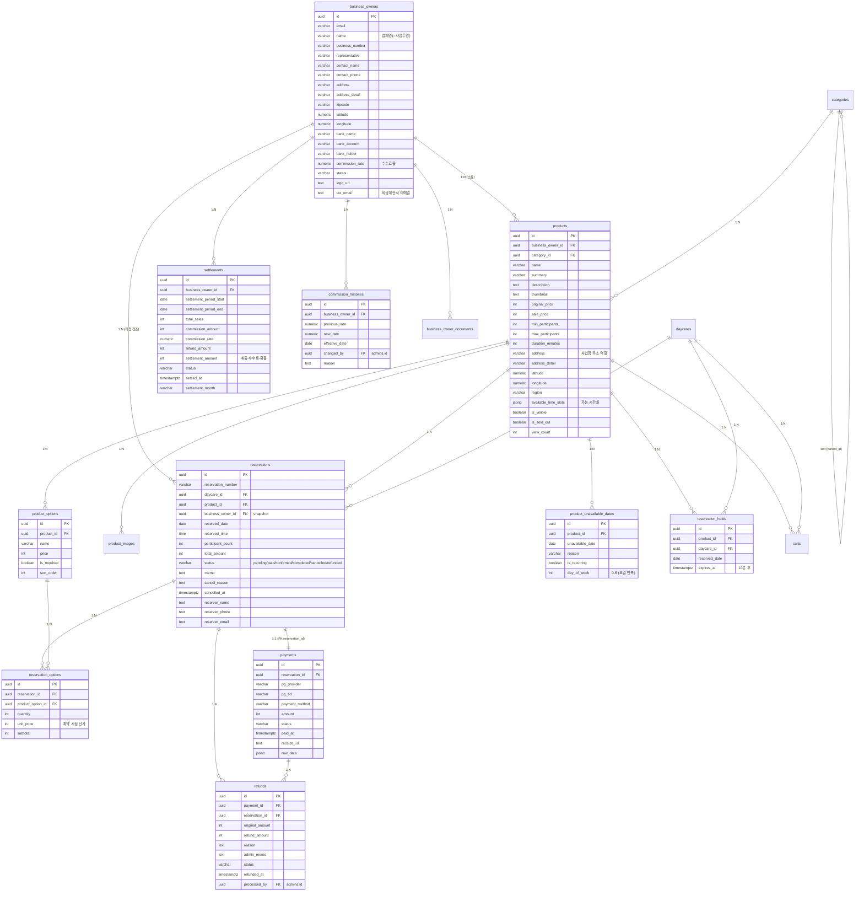

# 담다 DB 현황 ERD (리뷰용)

> 작성일: 2026-05-26
> 대상 DB: Supabase `damda` (project_id: `eifpjjoawsgdmeeuzhin`, region: `ap-northeast-2`, PostgreSQL 17.6)
> 목적: 2차 개발 **DB 개편 (사업주 → 사업장 → 상품 구조화)** 사전 리뷰

---

## 0. 한눈에 보기

- **총 테이블**: 37개 (public 스키마)
- **현재 핵심 구조**: `business_owners → products → reservations` (2단계, 사업장 개념 없음)
- **목표 구조 (견적서 No.2)**: `business_owners → 사업장(신규) → products → reservations` (3단계)
- **현재 "사업장" 정보**: `products` 테이블 안의 `address / latitude / longitude / region` 컬럼이 사업장 역할을 겸함 → 같은 사업장에 상품 N개여도 사업장 정보가 상품마다 중복 저장됨

---

## 1. 테이블 인벤토리 (37개)

영역별 분류 — 컬럼 개수와 코멘트 기준

### 1.1 회원 / 인증
| 테이블 | 컬럼 | 코멘트 |
|---|---|---|
| `admins` | 9 | 관리자 |
| `admin_logs` | 9 | 관리자 활동 로그 |
| `business_owners` | 21 | 사업주 |
| `business_owner_documents` | 10 | 사업주 문서 (사업자등록증, 통장사본, 영업신고증 등) |
| `daycares` | 24 | 어린이집 (회원) |
| `daycare_documents` | 10 | 어린이집 문서 (인가증 등) |
| `daycare_memos` | 5 | 어린이집 관리자 메모 |
| `user_roles` | 3 | 사용자 역할 (어린이집/사업주 구분) |

### 1.2 상품 / 카테고리 (개편 핵심)
| 테이블 | 컬럼 | 코멘트 |
|---|---|---|
| `categories` | 10 | 카테고리 (3단계 계층) |
| `products` | 23 | 체험 상품 |
| `product_images` | 5 | 상품 추가 이미지 |
| `product_options` | 7 | 상품 옵션 (인원별 가격 등) |
| `product_unavailable_dates` | 7 | 상품 예약 불가일 |
| `product_preview_tokens` | 6 | (코멘트 없음) |
| `regions` | 9 | 지역 (검색 UI용) |

### 1.3 예약 / 결제 / 정산 (개편 핵심)
| 테이블 | 컬럼 | 코멘트 |
|---|---|---|
| `reservations` | 18 | 체험 예약 |
| `reservation_options` | 7 | 예약 옵션 상세 |
| `reservation_holds` | 6 | 결제 홀드 - 동시 결제 방지 (10분 잠금) |
| `payments` | 12 | PG 결제 |
| `refunds` | 11 | 환불 처리 |
| `settlements` | 13 | 사업주 정산 |
| `commission_histories` | 8 | 수수료 변경 이력 |

### 1.4 부가 (장바구니/찜/리뷰)
| 테이블 | 컬럼 | 코멘트 |
|---|---|---|
| `carts` | 8 | 장바구니 |
| `wishlists` | 4 | 찜한 상품 |
| `recent_views` | 4 | 최근 본 상품 |
| `reviews` | 10 | 상품 리뷰 |
| `review_images` | 5 | 리뷰 첨부 이미지 |

### 1.5 컨텐츠 / CS
| 테이블 | 컬럼 | 코멘트 |
|---|---|---|
| `banners` | 11 | 배너 |
| `ad_banners` | 11 | 메인 카테고리 하단 광고 배너 (외부 업체 광고) |
| `popups` | 13 | 팝업 |
| `notices` | 9 | 공지사항 |
| `faqs` | 8 | FAQ |
| `inquiries` | 10 | 1:1 문의 |
| `partner_inquiries` | 19 | 입점 문의 |
| `legal_documents` | 9 | 법적 문서 (이용약관/개인정보/환불/예약안내) |
| `site_settings` | 5 | 사이트 설정 |
| `notification_logs` | 15 | 알림톡 발송 로그 |

---

## 2. 핵심 도메인 ERD — 사업주/상품/예약/결제/정산

> 견적서 개편 영역에 직접 닿는 12개 테이블만 추렸습니다.



---

## 3. 전체 관계도 (37 테이블, FK only)

```mermaid
erDiagram
    %% 회원/관리자
    admins ||--o{ admin_logs : ""
    admins ||--o{ commission_histories : "changed_by"
    admins ||--o{ daycare_memos : ""
    admins ||--o{ inquiries : "answered_by"
    admins ||--o{ legal_documents : "created_by"
    admins ||--o{ notices : "created_by"
    admins ||--o{ partner_inquiries : "reviewed_by"
    admins ||--o{ refunds : "processed_by"
    admins ||--o{ site_settings : "updated_by"

    %% 사업주
    business_owners ||--o{ business_owner_documents : ""
    business_owners ||--o{ commission_histories : ""
    business_owners ||--o{ products : ""
    business_owners ||--o{ product_preview_tokens : ""
    business_owners ||--o{ reservations : ""
    business_owners ||--o{ settlements : ""

    %% 어린이집
    daycares ||--o{ carts : ""
    daycares ||--o{ daycare_documents : ""
    daycares ||--o{ daycare_memos : ""
    daycares ||--o{ inquiries : ""
    daycares ||--o{ recent_views : ""
    daycares ||--o{ reservation_holds : ""
    daycares ||--o{ reservations : ""
    daycares ||--o{ reviews : ""
    daycares ||--o{ wishlists : ""

    %% 카테고리 / 지역 (셀프 참조)
    categories ||--o{ categories : "parent_id"
    categories ||--o{ products : ""
    regions ||--o{ regions : "parent_id"

    %% 상품
    products ||--o{ carts : ""
    products ||--o{ product_images : ""
    products ||--o{ product_options : ""
    products ||--o{ product_preview_tokens : ""
    products ||--o{ product_unavailable_dates : ""
    products ||--o{ recent_views : ""
    products ||--o{ reservation_holds : ""
    products ||--o{ reservations : ""
    products ||--o{ reviews : ""
    products ||--o{ wishlists : ""

    %% 예약/결제/정산
    reservations ||--o{ payments : ""
    reservations ||--o{ refunds : ""
    reservations ||--o{ reservation_options : ""
    reservations ||--o{ reviews : ""
    payments ||--o{ refunds : ""
    product_options ||--o{ reservation_options : ""

    %% 리뷰
    reviews ||--o{ review_images : ""
```



> **참조 무결성 정책 요약**: 사용자 데이터 종속(documents/cart/wishlist/recent_views/holds/options/images 등)은 **CASCADE**, 거래·이력(reservations/payments/refunds/settlements/admin 작업 흔적)은 **NO ACTION** — 거래 데이터는 부모가 삭제돼도 살아남음.

---

## 4. 견적서 2차 개발 ↔ 현재 DB 매핑

리뷰어가 한눈에 "뭐가 바뀌어야 하는지" 보기 위한 매핑 표입니다.

### 4.1 No.2 — 사장님 페이지 구조 개편 (★ DB 영향 최대)

| 견적서 요구 | 현재 DB 상태 | 개편 시 영향 |
|---|---|---|
| "사업자 → 사업장 → 상품" 3단계 구조 | `business_owners → products` 2단계. 사업장 테이블 없음 | **신규 `businesses`(or `venues`) 테이블 도입** 필요. 또는 `products`에서 사업장 컬럼 분리 |
| 사업장 안에서 상품 선택 (야놀자 방식) | products에 사업장 정보(`address`, `lat/lng`, `region`)가 직접 박혀있음 | products의 사업장 컬럼을 신규 테이블로 이동, `products.business_id` FK 추가 |
| 날짜 마감 = 상품 단위 | ✅ 이미 `product_unavailable_dates.product_id`로 상품 단위 | 그대로 유지 (현 구조와 일치) |
| 사업장 단위 노출/비노출, 휴무일 | 사업장 테이블 자체가 없음 | 신규 사업장 테이블에 `is_visible`, 휴무일 자식 테이블 신설 필요 |
| 사장님 직접 상품 등록·수정 (즉시 반영) | 이미 product_preview_tokens 존재 (워크플로 흔적). RLS 또는 API 권한 정책으로 통제 중일 가능성 | DB 변경 없음 / API·RLS 정책 영역 |
| 사업장 정보 수정 D+1 관리자 승인 | 승인 워크플로 컬럼 없음 (참고: daycares에는 `revision_*` 컬럼 있음) | 신규 사업장 테이블에 `pending_changes(jsonb)` + 승인 상태 컬럼 도입 검토 |

### 4.2 No.4 — 관리자 페이지 상품관리 개편

| 견적서 요구 | 현재 DB 상태 | 개편 시 영향 |
|---|---|---|
| "업체관리" → "상품관리" 이름 변경, 사업주 하위 이동 | 화면/메뉴 구조 이슈 | **DB 변경 없음** |
| 요일별 예약 가능 인원수 차별 설정 | `products.max_participants`(단일값) + `available_time_slots(jsonb)` | products에 요일별 정원 jsonb 추가 또는 자식 테이블 신설 |
| 세금계산서 이메일 빈값 버그 | `business_owners.tax_email`(nullable) 존재 | DB 변경 없음 — 애플리케이션 버그 |

### 4.3 No.5 — 상품 판매방식 다양화 (★ DB 영향 큼)

| 견적서 요구 | 현재 DB 상태 | 개편 시 영향 |
|---|---|---|
| 판매방식 1 — 하루 1건만 | 판매방식 구분 컬럼 자체가 없음 | `products.sale_type`(enum) 컬럼 신설 필요: `daily_one / time_slot / quantity` |
| 판매방식 2 — 시간대별 (요일별 설정) | `available_time_slots jsonb` 있지만 구조 불명 + 요일별 설정 없음 | jsonb 스키마 표준화 또는 별도 `product_time_slots` 테이블 신설 |
| 판매방식 3 — 정해진 수량 (잔여 표시) | 잔여 수량 컬럼 없음 (`is_sold_out` boolean만) | `product_inventory(product_id, date, total, sold)` 형태 자식 테이블 검토 |
| 시간대 마감 시 다음 회차 차단 여부 | 관련 컬럼 없음 | `products.block_next_slot_on_full boolean` 검토 |
| 휴무일/마감일 시각적 구분 | 현재 `product_unavailable_dates` 만으로는 휴무/마감 구분 안 됨 | `reason` 활용 또는 `kind` 컬럼 신설 |

### 4.4 No.6 — 정산 계산 방식 개선

| 견적서 요구 | 현재 DB 상태 | 개편 시 영향 |
|---|---|---|
| 부분 환불 후 남은 금액 정산 포함 | settlements에 `refund_amount`, `total_sales`, `commission_amount` 존재 | **DB 변경 없음** — 계산 로직 버그 수정 |
| 정산식 = (부분환불 후 잔액) − (결제총액 × 12%) | 컬럼은 충분 (`commission_rate`, `refund_amount`) | 계산 로직만 정정 |
| 전체 환불 건도 수수료 차감되는 버그 | refunds.refund_amount = original_amount 비교로 판별 가능 | 로직 수정 |

### 4.5 No.7 — 어린이집 인증 시스템

| 견적서 요구 | 현재 DB 상태 | 개편 시 영향 |
|---|---|---|
| 전국 어린이집 DB에서 선택 (키즈노트 방식) | `daycares`는 자체 입력 + `license_number` | **신규 `daycare_master` 테이블 도입** (외부 DB 동기화용) — 가입 시 master에서 선택 |
| 1 어린이집 = 1 계정 | `daycares.license_number` unique 인덱스 여부 확인 필요 | unique 제약 추가 검토 |
| 카카오 인증 | DB 영향 없음 (auth.users 메타 / 신규 컬럼) | `daycares.kakao_id` 정도 추가 검토 |

### 4.6 No.8 — 행정 서류 서비스

DB 변경은 거의 없음 — 장바구니 → 견적서 PDF 생성은 애플리케이션 레이어. `carts.options(jsonb)`가 이미 있음.

---

## 5. 리뷰어에게 묻고 싶은 포인트

리뷰 받을 때 같이 보면 좋을 의사결정 지점:

1. **사업장 테이블 신규 도입 vs products 컬럼 유지** — 사업장당 상품이 평균 몇 개인지(=중복도)에 따라 비용 다름
2. **상품 판매방식**: enum + 분기 처리 vs 판매방식별 별도 테이블 (`single_day_products`, `time_slot_products`, `inventory_products`)
3. **재고/잔여수량**: 별도 `product_inventory(product_id, date, sold_count)` 테이블 vs reservations 집계 쿼리
4. **시간대 예약**: `product_time_slots` 테이블 vs `products.time_slots jsonb` 유지
5. **사업장 수정 승인 워크플로**: 변경 요청 큐 테이블 vs daycares처럼 `pending_*` 컬럼 추가
6. **전국 어린이집 master 데이터**: 어디서 가져와서 어떻게 갱신할지 (보건복지부 공공데이터 등)
7. **마이그레이션 순서**: products의 사업장 정보를 새 테이블로 분리할 때 데이터 이관 전략 (1 사업주 = 1 사업장으로 시작하고 추후 분리?)

---

## 부록 A. 주요 Enum 값 (현재 운영)

- **`business_owners.status`**: `active` / (기타 미확인)
- **`reservations.status`**: `pending` / `paid` / `confirmed` / `completed` / `cancelled` / `refunded`
- **`payments.status`**: `pending` / `paid` / `failed` / `cancelled`
- **`refunds.status`**: `pending` / `completed` / `failed`
- **`settlements.status`**: `pending` / `completed`
- **`admins.role`**: `super_admin` / `admin` (CHECK 제약 존재)

## 부록 B. 데이터 추출 방법

이 문서는 아래 쿼리로 직접 추출한 정보 기반:

```sql
-- 테이블 인벤토리
SELECT table_name, obj_description((table_schema||'.'||table_name)::regclass) AS comment
FROM information_schema.tables
WHERE table_schema = 'public' AND table_type = 'BASE TABLE';

-- FK 관계
SELECT tc.table_name, kcu.column_name, ccu.table_name AS ref_table, ccu.column_name AS ref_col, rc.delete_rule
FROM information_schema.table_constraints tc
JOIN information_schema.key_column_usage kcu USING (constraint_name, table_schema)
JOIN information_schema.constraint_column_usage ccu USING (constraint_name, table_schema)
JOIN information_schema.referential_constraints rc USING (constraint_name)
WHERE tc.constraint_type = 'FOREIGN KEY' AND tc.table_schema = 'public';
```
